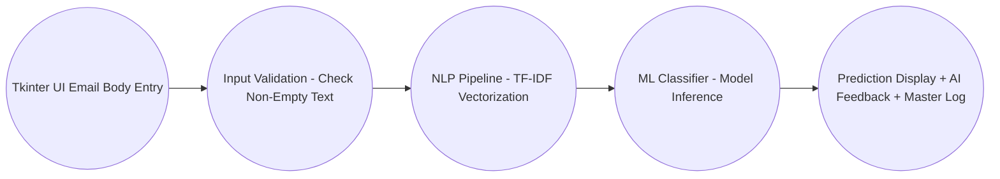

# Intelligent_Email_Spam_Detection_and_Filtering_System

#### 1. Problem Statement:
- Digital communication is heavily impacted by unsolicited, deceptive, and malicious emails.
- Users struggle to identify phishing and fraudulent scam messages before interacting with them.
- Traditional static keyword filters fail against evolving obfuscation and text manipulations.
- A real-time system is needed to analyze incoming email body text and provide immediate filtering decisions.

#### 2. Proposed Solution:
- Accept raw email body/sentence text directly from the user.
- Preprocess and tokenize text using NLP techniques (lowercasing, punctuation stripping, stop-word removal).
- Extract numerical features using TF-IDF vectorization (unigrams and bigrams).
- Classify the email as Spam or Ham using a Machine Learning classifier (Multinomial Naive Bayes / SVM / Logistic Regression).
- Calculate threat levels and generate actionable security recommendations.
- Display instant results and persist records to a master log via a clean Tkinter GUI.

#### 3. Process Flow:
<p align="center"> Start <br> &darr; <br> Enter Email Sentence / Body Text <br> &darr; <br> Validate Input <br> &darr; <br> Preprocess & TF-IDF Vectorization <br> &darr; <br> ML Model Prediction <br> &darr; <br> Determine Threat Level & Confidence <br> &darr; <br> Generate AI Recommendation <br> &darr; <br> Display Result in GUI & Save to CSV <br> &darr; <br> End</p>

#### 4. Project Mapping:
| V-Model Stage           | Intelligent Email Spam Project               |
|:------------------------|:---------------------------------------------|
| Requirement Analysis    | Identify spam detection from raw body text   |
| System Design           | Design NLP pipeline and single-window GUI    |
| Implementation          | Develop TF-IDF vectorizer + ML models        |
| Integration             | Integrate Tkinter GUI, ML, and AI heuristics | 
| Testing                 | Test text inputs, edge cases, and accuracy   |
| Validation              | Validate precision against false positives   |
| Demonstration           | Present working desktop application          |

### 5. Requirement Analysis
#### 5.1 Functional Requirements
The system should:
+ Accept single email body/sentence inputs via a multi-line text area.
+ Validate that the text input is not empty.
+ Preprocess input text and transform it into TF-IDF vectors.
+ Apply the trained ML classification model.
+ Predict whether the content is Spam or Ham.
+ Calculate spam probability confidence scores.
+ Generate actionable security advice based on threat levels.
+ Log individual results into `master_email_log.csv`.
+ Provide clear and exit options.

#### 5.2 Non Functional Requirements:
The application should be:
+ User-friendly and distraction-free
+ Fast in generating real-time predictions
+ Reliable and consistent
+ Modular and maintainable
+ Lightweight with low memory footprint

#### 5.3 Identify the Users
Primary Users may include:
  + Email Users / Consumers
  + Helpdesk Support Engineers
  + IT Administrators

#### 5.4 User Requirements
The user should be able to:
+ Paste any suspicious or regular email sentence/body text.
+ Click a single button to analyze the message.
+ View the classification verdict (Spam vs. Ham).
+ See the estimated threat severity.
+ Read concrete advice on whether to quarantine, delete, or trust the email.

#### 5.5 Identify System Inputs
+ Email Sentence / Body Text (Raw unstructured text)

#### 5.6 Identify System Outputs
###### 5.6.1 Classification Verdict
  + Spam
  + Ham (Legitimate)

###### 5.6.2 Additional Outputs
  + Spam Probability Confidence (%)
  + Threat Level (High Threat, Moderate Threat, Suspicious, Safe)
  + Actionable AI Recommendation

###### Example
__Prediction:__ Spam (94.20% Spam Probability) \
__Threat Level:__ High Threat (Malicious/Phishing) \
__Recommendation:__ Move to Quarantine immediately; urgent psychological pressure detected — do not click links or share credentials.

#### 6. Project Modular Application Development
Modular functions structured across the system:
+ clean_sentence()
+ calculate_threat_level()
+ ai_email_feedback()
+ predict_sentence_spam()
+ clear_fields()
+ append_to_master_csv()

#### 7. From Requirements to System Design
##### __7.1 Input__
+ Email Sentence / Body Text

##### __7.2 Processing__
+ Text tokenization & stop-word removal
+ TF-IDF feature transformation
+ Machine Learning inference
+ Threat rule-matching

##### __7.3 Output__
+ Prediction (Spam / Ham)
+ Confidence score
+ Threat level
+ Action recommendation

#### 8. Proposed System Architecture


#### 9. UI Design RequirementsThe application contains:
###### 9.1. Input Section
+ Multi-line Scrolled Text Area for Email Body
###### 9.2. Action Section
+ Predict Entry
+ Clear
+ Exit
###### 9.3. Result Section
+ Prediction Verdict & Confidence
+ Threat Severity Level
+ Actionable Advice
#### 10. Using Frames
```Main Window
├── Header Title
├── Email Body Input Frame (ScrolledText)
├── Action Buttons Frame
└── Result & Recommendation Frame
```
#### 11. ML Workflow
+ Dataset Creation
  + Balanced email sentence dataset
+ Data Loading & Vectorization
  + Load dataset with Pandas
  + Transform sentences into TF-IDF vector matrix
+ Model Training
  + Train Multinomial Naive Bayes / Logistic Regression / SVM (80/20 train-test split)
+ Model Evaluation
  + Calculate Accuracy, Precision, Recall, and F1-Score
+ Prediction & Persistence
  + Test with individual email sentences
  + Save .pkl model and vectorizer artifacts
#### 12. Problem Type
  + Binary Text Classification Problem
  + Categories: Spam, Ham
  + Probability Estimation
  + Spam score: 0.0% – 100.0%
#### 13. Model Selection
+ Algorithms Evaluated:
  + Multinomial Naive Bayes
  + Logistic RegressionSupport Vector Classifier (LinearSVC)
  + Random Forest Classifier
  + Decision Tree Classifier
+ Evaluation Metrics:
  + Accuracy Score
  + Precision / Recall / F1-Score
  + Confusion Matrix
